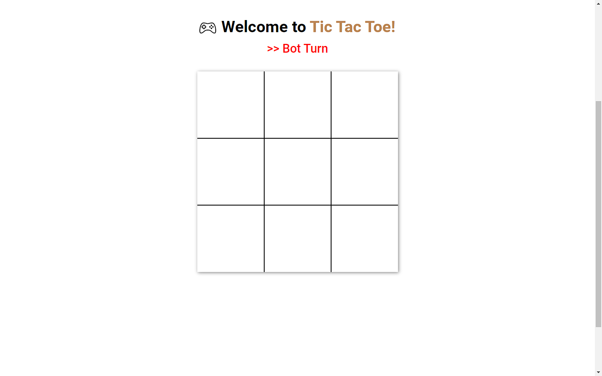
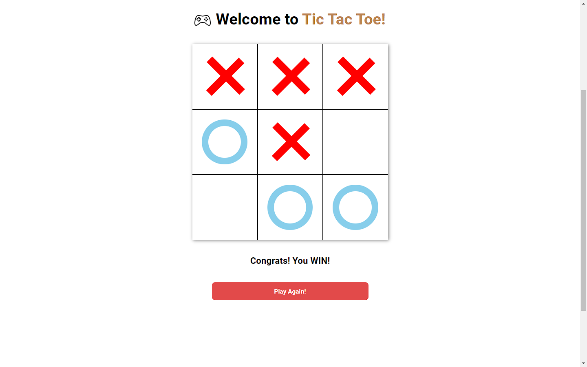
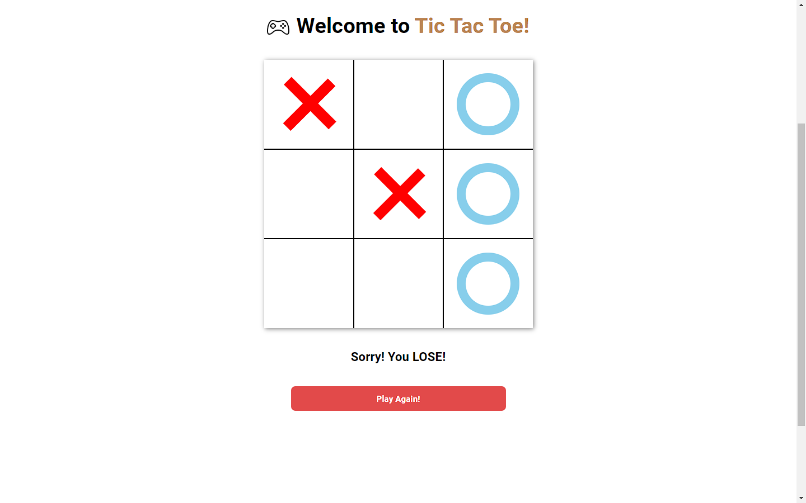

# Tic Tac Toe

this is a simple tic tac toe game that I created using HTML, CSS, and Javascript. This game is simple, you just need to make patterns either horizontally, vertically or diagonally in the form of crosses or circles. For the time being, this game is PvP only.

## Next Feauture
- [ ] Player vs Bot
- [ ] Win Score

## Screenshots

## Reference
- [Super Easy Tic-tac-toe in JavaScript!](https://www.youtube.com/watch?v=DRaWr0Dcbl0&t=1408s)
- [Build Tic Tac Toe With JavaScript - Tutorial](https://www.youtube.com/watch?v=Y-GkMjUZsmM&t=793s)
- [JavaScript Tic Tac Toe Project Tutorial - Unbeatable AI w/ Minimax Algorithm](https://www.youtube.com/watch?v=P2TcQ3h0ipQ)